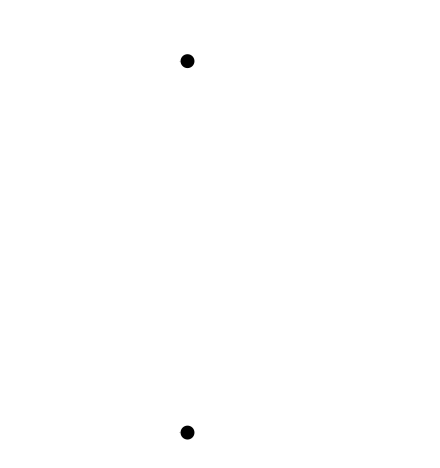
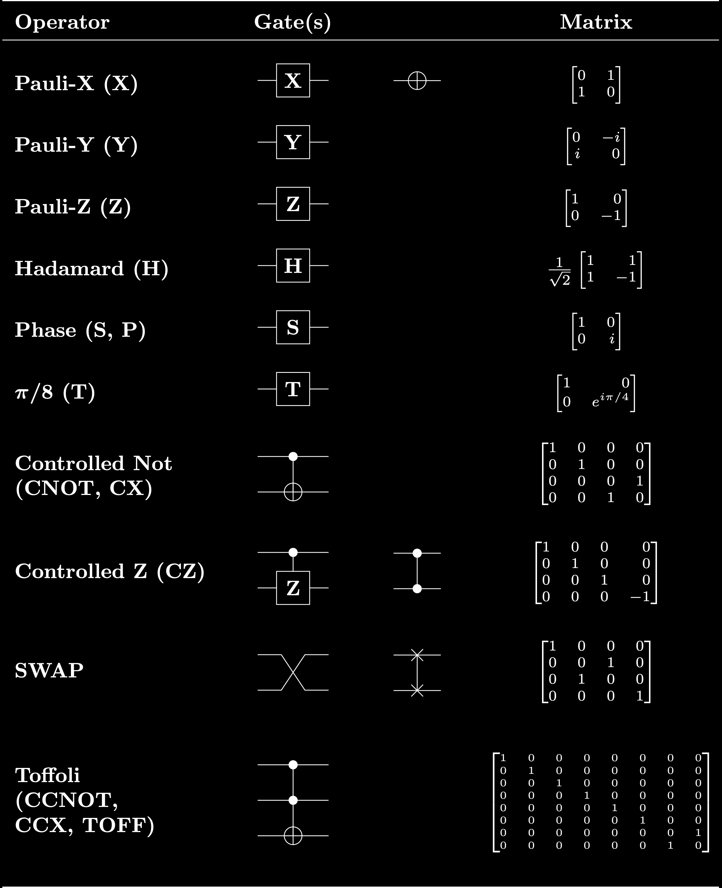

# Quantum Computing Basic Background Information

## Contents

- [Important Disclaimer](#Important-Disclaimer)

- [Qubit Notation](#Qubit-Notation)

- [Bloch Sphere](#Bloch-Sphere)

- [Quantum Logic Gate Notation](#Quantum-Logic-Gate-Notation)

- [Quantum Algorithms](#Quantum-Algorithms)

***

## Important Disclaimer

Images (including LaTex) will be visible regardless of color settings on most
IDEs such as PyCharm and Visual Studio Code regardless of the theme color
setting (ie: dark mode, high contrast, light mode, etc.). However, light mode
users may have issues viewing images if HTML div displaying is disabled
(which is the case on GitHub's Markdown viewer).

This version is designed to be compatible with dark mode, high contrast, and
most themes other than light mode.

- [Light Mode](LightModeBACKGROUND.md)

<br/>

## Qubit Notation

Qubits can be represented using
[bra-ket notation](https://chem.libretexts.org/Bookshelves/Physical_and_Theoretical_Chemistry_Textbook_Maps/Supplemental_Modules_(Physical_and_Theoretical_Chemistry)/Quantum_Mechanics/03._The_Tools_of_Quantum_Mechanics/Bra-Ket_Notation)
(or Dirac notation)

Equivalently, qubits can be represented using vectors.

**Bra Notation**

<div style="background-color:rgb(0, 0, 0); text-align:center; vertical-align: middle; padding:10px">


</div>

<br />

**Ket Notation**

<div style="background-color:rgb(0, 0, 0); text-align:center; vertical-align: middle; padding:10px">


</div>


† is the
[Hermitian conjugate (or the conjugate transpose)](https://mathworld.wolfram.com/ConjugateTranspose.html)
which is the transpose of the conjugate matrix.  The
[conjugate matrix](https://mathworld.wolfram.com/ConjugateMatrix.html)
is the matrix obtained by taking the complex conjugate of each element of the
matrix.

⊕ is the
[Kronecker product](https://mathworld.wolfram.com/KroneckerProduct.html)
which is the matrix generalization of the vector
[outer product](https://en.wikipedia.org/wiki/Outer_product).

[comment]: <> (Example bras)
<details>
    <summary>Example bras</summary>

<br />

<div style="background-color:rgb(0, 0, 0); text-align:center; vertical-align: middle; padding:10px">


</div>

<br />

[comment]: <> (0 bra)

<div style="background-color:rgb(0, 0, 0); text-align:center; vertical-align: middle; padding:10px">


</div>

<br />

[comment]: <> (1 bra)
<div style="background-color:rgb(0, 0, 0); text-align:center; vertical-align: middle; padding:10px">


</div>

<br />

[comment]: <> (00 bra)
<div style="background-color:rgb(0, 0, 0); text-align:center; vertical-align: middle; padding:10px">


</div>

<br />

[comment]: <> (01 bra)
<div style="background-color:rgb(0, 0, 0); text-align:center; vertical-align: middle; padding:10px">


</div>

<br />

[comment]: <> (10 bra)
<div style="background-color:rgb(0, 0, 0); text-align:center; vertical-align: middle; padding:10px">


</div>

<br />

[comment]: <> (11 bra)
<div style="background-color:rgb(0, 0, 0); text-align:center; vertical-align: middle; padding:10px">


</div>

<br />

[comment]: <> (000 bra)
<div style="background-color:rgb(0, 0, 0); text-align:center; vertical-align: middle; padding:10px">


</div>

<br />

[comment]: <> (001 bra)
<div style="background-color:rgb(0, 0, 0); text-align:center; vertical-align: middle; padding:10px">


</div>

<br />

[comment]: <> (010 bra)
<div style="background-color:rgb(0, 0, 0); text-align:center; vertical-align: middle; padding:10px">


</div>

<br />

[comment]: <> (011 bra)
<div style="background-color:rgb(0, 0, 0); text-align:center; vertical-align: middle; padding:10px">


</div>

<br />

[comment]: <> (100 bra)
<div style="background-color:rgb(0, 0, 0); text-align:center; vertical-align: middle; padding:10px">


</div>

<br />

[comment]: <> (101 bra)
<div style="background-color:rgb(0, 0, 0); text-align:center; vertical-align: middle; padding:10px">


</div>

<br />

[comment]: <> (110 bra)
<div style="background-color:rgb(0, 0, 0); text-align:center; vertical-align: middle; padding:10px">


</div>

<br />

[comment]: <> (111 bra)
<div style="background-color:rgb(0, 0, 0); text-align:center; vertical-align: middle; padding:10px">


</div>

</details>

<br />

[comment]: <> (Example kets)

<br />

<details>
    <summary>Example kets</summary>

<div style="background-color:rgb(0, 0, 0); text-align:center; vertical-align: middle; padding:10px">


</div>

<br />

[comment]: <> (0 ket)
<div style="background-color:rgb(0, 0, 0); text-align:center; vertical-align: middle; padding:10px">


</div>

<br />

[comment]: <> (1 ket)
<div style="background-color:rgb(0, 0, 0); text-align:center; vertical-align: middle; padding:10px">


</div>

<br />

[comment]: <> (00 ket)
<div style="background-color:rgb(0, 0, 0); text-align:center; vertical-align: middle; padding:10px">


</div>

<br />

[comment]: <> (01 ket)
<div style="background-color:rgb(0, 0, 0); text-align:center; vertical-align: middle; padding:10px">


</div>

<br />

[comment]: <> (10 ket)
<div style="background-color:rgb(0, 0, 0); text-align:center; vertical-align: middle; padding:10px">


</div>

<br />

[comment]: <> (11 ket)
<div style="background-color:rgb(0, 0, 0); text-align:center; vertical-align: middle; padding:10px">


</div>

<br />

[comment]: <> (000 ket)
<div style="background-color:rgb(0, 0, 0); text-align:center; vertical-align: middle; padding:10px">


</div>

<br />

[comment]: <> (001 ket)
<div style="background-color:rgb(0, 0, 0); text-align:center; vertical-align: middle; padding:10px">


</div>

<br />

[comment]: <> (010 ket)
<div style="background-color:rgb(0, 0, 0); text-align:center; vertical-align: middle; padding:10px">


</div>

<br />

[comment]: <> (011 ket)
<div style="background-color:rgb(0, 0, 0); text-align:center; vertical-align: middle; padding:10px">


</div>

<br />

[comment]: <> (100 ket)
<div style="background-color:rgb(0, 0, 0); text-align:center; vertical-align: middle; padding:10px">


</div>

<br />

[comment]: <> (101 ket)
<div style="background-color:rgb(0, 0, 0); text-align:center; vertical-align: middle; padding:10px">


</div>

<br />

[comment]: <> (110 ket)
<div style="background-color:rgb(0, 0, 0); text-align:center; vertical-align: middle; padding:10px">


</div>

[comment]: <> (111 ket)
<div style="background-color:rgb(0, 0, 0); text-align:center; vertical-align: middle; padding:10px">


</div>

</details>

<br />

## Bloch Sphere

<div style="background-color:rgb(0, 0, 0); text-align:center; vertical-align: middle; padding:10px">



</div>

[Original image](https://upload.wikimedia.org/wikipedia/commons/6/6b/Bloch_sphere.svg)

The [Bloch sphere](https://mathworld.wolfram.com/BlochSphere.html)
is the unit sphere shown above with the qubit |Ψ⟩=a|0⟩+b|1⟩ represented as the
point (0, Φ).

The [Bloch sphere](https://en.wikipedia.org/wiki/Bloch_sphere)
is a geometrical representation of the pure state space of a qubit.

## Quantum Logic Gate Notation

Further reading about quantum logic gates:

- [CWI Thesis On Quantum Computation Theory](https://www.illc.uva.nl/Research/Publications/Dissertations/DS-2002-04.text.pdf)

- [Wikipedia](https://en.wikipedia.org/wiki/Quantum_logic_gate)



[Original image](https://upload.wikimedia.org/wikipedia/commons/e/e0/Quantum_Logic_Gates.png)

<br/>

### Identity Gate

<details>
    <summary>Identity Gate</summary>

The identity gate is a gate that leaves the quantum state unchanged.

The identity gate can be represented in matrix form as the
[identity matrix](https://mathworld.wolfram.com/IdentityMatrix.html).

</details>

### Pauli Gates

<details>
    <summary>Pauli Gates</summary>

The [Pauli gates (X, Y, Z)](https://en.wikipedia.org/wiki/Quantum_logic_gate#Pauli_gates_(X,Y,Z))
are the three Pauli matrices and act on a single qubit.

The Pauli X, Y, and Z equate, respectively, to a rotation around the
x, y, and z axes of the
[Bloch sphere](#Bloch-Sphere)
by π radians.

#### Pauli-X Gate

<details>
    <summary>Pauli-X Gate</summary>

The
[Pauli-X gate](https://www.quantum-inspire.com/kbase/pauli-x/)
is a single-qubit rotation through π radians around the x-axis of the
[Bloch sphere](#Bloch-Sphere).

The
[Pauli-X gate](https://en.wikipedia.org/wiki/Quantum_logic_gate#Pauli_gates_(X,Y,Z))
(sometimes called a bit-flip) is equivalent to the
[NOT gate](https://en.wikipedia.org/wiki/Inverter_(logic_gate))
for classical computers with respect to the standard basis |0⟩, |1⟩.

</details>

#### Pauli-Y Gate

<details>
    <summary>Pauli-Y Gate</summary>

The
[Pauli-Y gate](https://www.quantum-inspire.com/kbase/pauli-y/)
is a single-qubit rotation through π radians around the y-axis of the
[Bloch sphere](#Bloch-Sphere).

The
[Pauli-Y gate](https://en.wikipedia.org/wiki/Quantum_logic_gate#Pauli_gates_(X,Y,Z))
maps |0⟩ to i|1⟩ and |1⟩ to -i|0⟩.

</details>

#### Pauli-Z Gate

<details>
    <summary>Pauli-Z Gate</summary>

The
[Pauli-Z gate](https://www.quantum-inspire.com/kbase/pauli-z/)
is a single-qubit rotation through π radians around the z-axis of the
[Bloch sphere](#Bloch-Sphere).

The
[Pauli-Z gate](https://en.wikipedia.org/wiki/Quantum_logic_gate#Pauli_gates_(X,Y,Z))
(sometimes called the phase-flip) maps |0⟩ to |0⟩ and |1⟩ to -|1⟩.

</details>

</details>

### Hadamard Gate

<details>
    <summary>Hadamard Gate</summary>

The Hadamard gate represents a rotation of π about the axis

<div style="background-color:rgb(0, 0, 0); text-align:center; vertical-align: middle; padding:10px">


</div>

at the
[Bloch sphere](#bloch-sphere).

The [Hadamard gate](https://en.wikipedia.org/wiki/Quantum_logic_gate#Hadamard_gate)
maps the basis states (ie: creates a superposition if given a basis state):

<div style="background-color:rgb(0, 0, 0); text-align:center; vertical-align: middle; padding:10px">


</div>

<div style="background-color:rgb(0, 0, 0); text-align:center; vertical-align: middle; padding:10px">


</div>

</details>

### H1 Gate

<details>
    <summary>H1 Gate</summary>

The H1 gate is the
[Hadamard transformation](#hadamard-gate)
for a single qubit (or the Hermitian).

</details>

### Controlled Gates

<details>
    <summary>Controlled Gates</summary>

[Controlled gates](https://en.wikipedia.org/wiki/Quantum_logic_gate#Controlled_gates)
use control qubits and target qubits.

Control qubits act as a control for an operation applied to the target qubits.

Controlled gates usually start **C-** such as the two-qubit the
[controlled NOT gate](#cnot-gate) which is also known as the
[CNOT gate](#cnot-gate).

Controlled gates can be extended to more than two qubits by having more control
qubits as well as by having more target qubits.

For example, the three-qubit
[Toffoli gate (or the CCNOT gate)](#toffoli-gate)
has two control qubits and one target qubit.

</details>

### CNOT Gate

<details>
    <summary>CNOT Gate (CX Gate)</summary>

The CNOT gate is a
[controlled gate](#controlled-gates).

The
[CNOT gate (or CX gate)](https://www.quantum-inspire.com/kbase/cnot/)
is a two-qubit operation with the first qubit referred to as the control qubit
and the second qubit referred to as the target qubit. The CNOT gate performs a
[Pauli-X gate](#pauli-x-gate)
on the target qubit when the control qubit is in state |1⟩.

The
[CNOT gate (or controlled Pauli-X gate)](https://en.wikipedia.org/wiki/Quantum_logic_gate#Controlled_gates)
maps the basis states |a, b⟩ ⟼ |a, a ⊕ b⟩, where ⊕ is XOR.

</details>

### CY Gate

<details>
    <summary>CY Gate</summary>

The CY gate is a
[controlled gate](#controlled-gates).

The CY gate (or controlled Pauli-Y gate) is a two-qubit operation with the
first qubit referred to as the control qubit and the second qubit referred to
as the target qubit. The CY gate performs a
[Pauli-Y gate](#pauli-y-gate)
on the target qubit when the control qubit is in state |1⟩.

</details>

### CZ Gate

<details>
    <summary>CZ Gate</summary>

The CZ gate is a
[controlled gate](#controlled-gates).

The CZ gate (or controlled Pauli-Z gate) is a two-qubit operation with the
first qubit referred to as the control qubit  and the second qubit referred to
as the target qubit. The CZ gate performs a
[Pauli-Z gate](#pauli-z-gate)
on the target qubit when the control qubit is in state |1⟩.

</details>

### Swap Gate

<details>
    <summary>Swap Gate</summary>

The [swap gate](https://www.quantum-inspire.com/kbase/swap/) swaps two qubits with respect to the basis |00⟩, |01⟩, |10⟩, |11⟩

The swap gate addresses the following problem:

Given two integers **a** and **b**, swap their values without using temporary variables.

Using Python, this can be accomplished with the following code
(where ^ is the XOR operator in Python):

```
a ^= b
b ^= a
a ^= b
```

Feel free to try the above Python code for yourself on
[replit](https://replit.com/@AlexLim-Pro/IntegerSwap#main.py).

</details>

### Toffoli Gate

<details>
    <summary>Toffoli Gate (CCNOT Gate)</summary>

The Toffoli gate is a
[controlled gate](#controlled-gates).

The
[Toffoli gate (or the CCNOT gate) (or the CCX gate)](https://www.quantum-inspire.com/kbase/toffoli/)
is a three-qubit operation with the first two qubits referred to as the control
qubits and the third qubit referred to as the target qubit. The Toffoli gate
performs a [Pauli-X gate](#pauli-x-gate) if and only if both control qubits
are in state |1⟩.

</details>

<br/>

## Quantum Algorithms

### [Grover's Search Algorithm](CompletedExamples/GroverSearchAlgorithm.py)

<details>
    <summary>Grover's Search Algorithm</summary>

In order to search through a list where nothing is known about the ordering
of the list, a classical computer cannot find an element of the list in less
than *O(N)* evaluations because in the worst case, a classical computer would
need to go through the entire list in order to find said element.

On the other hand,
[Grover's search algorithm](https://quantum-computing.ibm.com/composer/docs/iqx/guide/grovers-algorithm)
only needs to evaluate the
function *O(√(N))* times.

Much like brute force guess and check programs, Grover's search algorithm can
be used to guess and check in order to more quickly finds solutions than
pure brute force. For example, this can be used to solve Sudoku boards.

</details>

### [Shor's Factoring Algorithm](CompletedExamples/ShorFactoringAlgorithm.py)

<details>
    <summary>Shor's Factoring Algorithm</summary>

Shor's factoring algorithm finds the factors of a composite number in
polynomial time <em>O(</em>log<em>(N)</em>. For reference, using the classical Dixon's
factoring method, the optimal time complexity is

<div style="background-color:rgb(0, 0, 0); text-align:center; vertical-align: middle; padding:10px">


</div>

Shor's factoring algorithm can be used to break
[RSA encryption](https://en.wikipedia.org/wiki/RSA_(cryptosystem)).

In short, in order to factor a number **N**, after guessing a number **g**
that shares factors with **N**, Shor's factoring algorithm finds the period
**p** of the cyclic group

<div style="background-color:rgb(0, 0, 0); text-align:center; vertical-align: middle; padding:10px">


</div>

and uses **p** to find a better guess **q** that is more likely to share factors
with **N**.

<div style="background-color:rgb(0, 0, 0); text-align:center; vertical-align: middle; padding:10px">


</div>

Further reading about Shor's factoring algorithm:

- [Chemistry LibreTexts](https://chem.libretexts.org/Bookshelves/Physical_and_Theoretical_Chemistry_Textbook_Maps/Supplemental_Modules_(Physical_and_Theoretical_Chemistry)/Quantum_Tutorials_(Rioux)/Quantum_Teleportation/381%3A_Factoring_Using_Shor's_Quantum_Algorithm)

- [minutephysics](https://www.youtube.com/watch?v=lvTqbM5Dq4Q)

- [Qiskit Lectures](https://www.youtube.com/watch?v=mAHC1dWKNYE)

- [Wikipedia](https://en.wikipedia.org/wiki/Shor%27s_algorithm)

</details>

### [Computing Discrete Logarithms](CompletedExamples/ComputingDiscreteLogarithms.py)

<details>
    <summary>Computing Discrete Logarithms</summary>

The Discrete Logarithm Problem:

<div style="color:white; background-color:rgb(0, 0, 0); text-align:left; vertical-align: middle; padding:10px">
Let <b>g</b> be a generator of the group <b>G</b> of order <b>n</b>.
<br/>
Let <b>c</b> be the cipher.
<br/>
Let <b>p</b> be the prime modulus.
<br/>
Given

.
<br/>
Find the value of <b>k</b>
</div>

The specific implementation used in BitOQSim is the
[Pohlig-Hellman algorithm](https://ee.stanford.edu/~hellman/publications/28.pdf)
where
[Shor's factoring algorithm](#[Shor's Factoring Algorithm](CompletedExamples/ShorFactoringAlgorithm.py))
is used to find the prime factorization of the order of the group **G**.

The Pohlig-Hellman algorithm uses the prime factorization of the order of the
group **G** to split the discrete logarithm problem into smaller subgroups
which can then be solved with
[Chinese remainder theorem](https://mathworld.wolfram.com/ChineseRemainderTheorem.html).

Further reading about discrete logarithms:

- [Estimating Gauss Sums and Calculating Discrete Logarithms](https://sites.cs.ucsb.edu/~vandam/gausssumdlog.pdf)

- [Khan Academy](https://www.khanacademy.org/computing/computer-science/cryptography/modern-crypt/v/discrete-logarithm-problem)

- [Wikipedia](https://en.wikipedia.org/wiki/Pohlig%E2%80%93Hellman_algorithm)

</details>

<br/>
